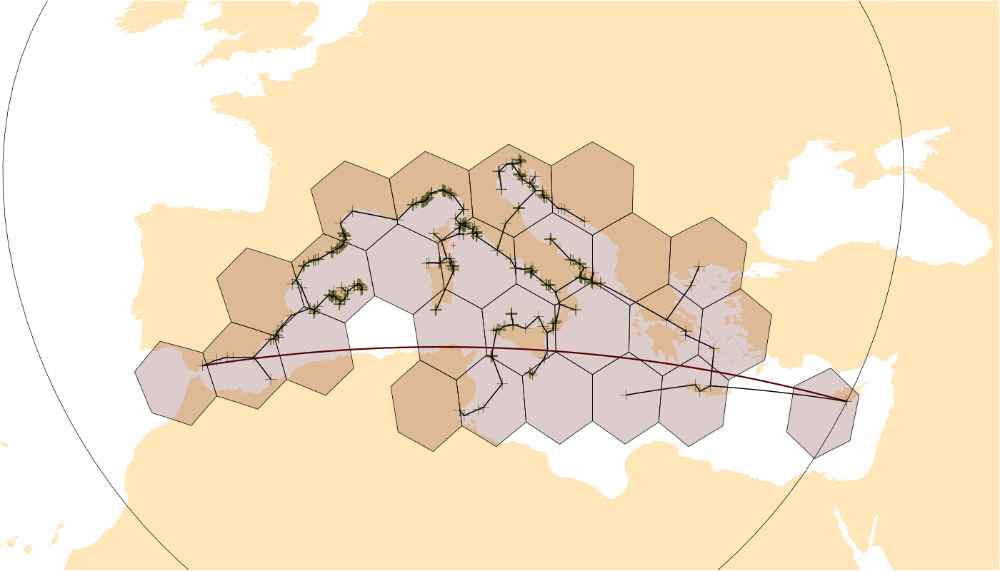

```{r setup, include=FALSE}
knitr::opts_chunk$set(echo = TRUE)

library(badger)
```

# orange 

`r badge_devel("adamkocsis/orange", "green")`
`r badge_cran_release("orange", "blue")`
`r badge_cran_download("orange", "grand-total", "yellow")`
`r badge_cran_checks("orange")`

## Spherical Ranges and Parametrization of Geographic Shapes

This package is a collation of tools and metrics to characterize distribution data on the surfrace of a sphere or an ellipsoid. The primary group of these metrics is those that describe the extent of a distribution, i.e. geographic ranges/range sizes (depending on who you talk to). The calculation of geographic ranges can be executed using point coordinate data,  as well as and cells on a discretized sphere, vector polygons and raster. Besides ensuring the use a geometrically correct implementations, the package offers the exploration of partial results for visual diagnostics and further post-processing.

* * *

## Dependencies

The functions of the package are dependent on geographic discretization structures. Due to its utility, the only hard dependency is `icosa`, which implements near equal area gridding of the sphere. Additional spatial structures include vector-spatial and raster objects implmented in the `sf` and `terra` packages, respectively.  

* * *

## Example use


```{r pinnaFa, include=FALSE}
library(orange)

# background map
library(chronosphere)
ne <- fetch("NaturalEarth", verbose=FALSE)

# some example data
data(pinna)
nobilis <- pinna[pinna$species=="Pinna nobilis", ]

# omit duplicates and rename coordinates
coords <- unique(nobilis[, c("decimalLongitude", "decimalLatitude")])
colnames(coords) <- c("long", "lat")

# omit issue coordinate
coords <- coords[-c(127,155), ]


png("man/figures/range_example.png", width=1400,height=800)
	# basic plot
	par(mar=rep(0.1,4))
	plot(ne$geometry, reset=FALSE, xlim=c(-15, 40), ylim=c(30, 50), col="#ffe7ba", border=NA)
	points(coords, pch=3, col="#5d7327", cex=2)

	# maximum great circle distance
	mgcd <- mgcd(coords, plot=TRUE)

	# Occupancy on a hexagonal grid
	hex <- hexagrid(deg=2, sf=TRUE) # from package icosa
	occ <- occupancy(coords, s=hex, plot=TRUE)

	# minimum spanning tree length
	mst <- mstlength(coords, plot=TRUE, plot.args=list(lwd=2))

dev.off()
```


```{r pinna_run, eval=FALSE}
library(orange)

# background map
library(chronosphere)
ne <- fetch("NaturalEarth", verbose=FALSE)

# some example raw data (Pinna nobilis from OBIS)
data(pinna)
nobilis <- pinna[pinna$species=="Pinna nobilis", ]

# only coords
coords <- unique(nobilis[, c("decimalLongitude", "decimalLatitude")]) 
# rename to standard
colnames(coords) <- c("long", "lat") 

# omit issue localities
coords <- coords[-c(127,155), ]

# basic plot
plot(ne$geometry, reset=FALSE, xlim=c(-15, 40), ylim=c(30, 50),
	col="#ffe7ba", border=NA)
points(coords, pch=3, col="#5d7327", cex=2)

# Maximum great circle distance
mgcd <- mgcd(coords, plot=TRUE)

# Occupancy on a hexagonal grid
hex <- hexagrid(deg=2, sf=TRUE) # from package icosa
occ <- occupancy(coords, s=hex, plot=TRUE)

# Minimum spanning tree length
mst <- mstlength(coords, plot=TRUE, plot.args=list(lwd=3))
```




```{r mgcd}
# Maximum great circle distance
mgcd
```

```{r occ}
# Occupancy count 
occ
```


## Abstraction 

The following sections provides a summary of the methods implemented in the package at an abstract level. These abstract methods are implemented as generic functions, which have dedicated sections in the [Specification](). 

### Range/extent esimators 

he metrics in this section define ways to derive the extent or **range** of an input strucutre.

| In | Method                       | Abstract Description                                                                                                                                               |
|----|------------------------------|--------------------------------------------------------------------------------------------------------------------------------------------------------------------|
| ✅ | Occupancy                    | The number of occupied elements in a pre-defined spatially discretized structure.                                                                                  |
| ✅ | Maximum Distance             | The longest distance that can be observed in a data-structure. The default method for this metric is the **Maximum Great Circle Distance**.                        |
| ✅ | Radius                       | The longest distance that can be constructed between any member of a point-cloud and a fixed point. The default method for this metric is the **Centroid radius**. |
| ✅ | Latitudinal range            | The zonal distance between the northernmost and southernmost point of a spatial strucutre.                                                                         |
| ❌ | Zonal area                   | The area of the zone (latitudinal belt) covered by a spatial structure - calculated from the Latitudinal Range.                                                    |
| ✅ | Minimum Spanning Tree Length | The total length of the spanning tree constructed within a spatial object (default to using the great circle distance matrix).                                     |
| ❌ | Hull Area                    | The area of a hull (enclosing polygon) constructed around a distribution, the most commonly used is the **Convex hull**.                                           |
| ❌ | Circle Area                  | The area of a shape that divides the sphere in two based on a single small circle.                                                                                 |


### Structure definers 

These methods define and structures constructed from the input data, which are used in subsequent calculations.

| In | Method        | Abstract Description                                                                             |
|----|---------------|--------------------------------------------------------------------------------------------------|
| ❌ | small circles | Defines a spherical circle (small or great) around a distribution structure.                     |
| ❌ | triangulation | Spherical triangulation of a given pointset.                                                     |
| ❌ | hull          | Defines a hull, i.e. and enclosing spherical polygon.                                            |
| ✅ | patches       | Identifies occupied, unconnected patches or islands in the distribution                          |
| ✅ | holes         | Identified unoccupied, unconnected patches or islands (i.e. holes) the distribution distribution |
| ❌ | ellipse       | Defines a spherical ellipse around a distribution structure.                                     |

### Location and shape esimators 

| In | Method            | Abstract Description                                                                                                        |
|----|-------------------|-----------------------------------------------------------------------------------------------------------------------------|
| ✅ | centroid          | The center point of distribution on the surface of Earth.                                                                   |
| ❌ | gappiness         | The proportion of unoccupied vs. total spatial units in a distribution within a constructed spatial structure, e.g. a hull. |
| ❌ | filling           | The proportion of unoccupied vs. total spatial units in a distribution within a constructed spatial structure, e.g. a hull. |
| ✅ | number of patches | The number of occupied patches of area for the distribution sample.                                                         |
| ✅ | number of holes   | The number of enclosed holes for the distribution sample.                                                                  |
| ❌ | eccentricity      | The eccentricity of an ellipse calculated from the distribution sample.                                                     |
	

### Auxilliary/Utility functions 

| Method                      | Abstract Description                                     | TODO           |
|-----------------------------|----------------------------------------------------------|----------------|
| Graph distance (`graphdist`) | Calculate the distance matrix for a grid, and a bunch of | Move to icosa? |

* * *

This is a pre-alpha version, and like R, comes with absolutely no warranty.


