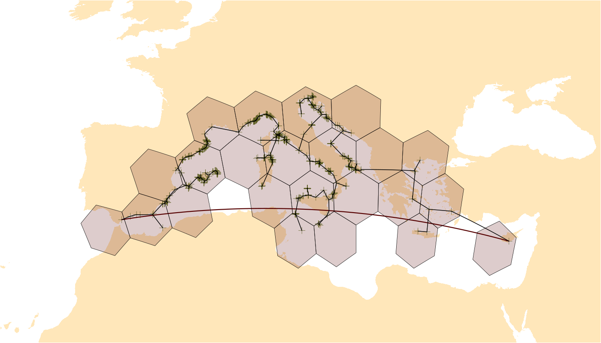

# orange 

[](https://github.com/adamkocsis/orange)
[](https://cran.r-project.org/package=orange)
[](https://cran.r-project.org/package=orange)
[](https://cran.r-project.org/web/checks/check_results_orange.html)

## Spherical Ranges and Parametrization of Geographic Shapes

This package is a collation of tools and metrics to characterize
distribution data on the surfrace of a sphere or an ellipsoid. The
primary group of these metrics is those that describe the extent of a
distribution, i.e. geographic ranges. The calculation of geographic
ranges can be executed using point coordinates data, vector polygons, as
well as and cells on a discretized sphere. Besides ensuring the use a
geometrically correct implementations, the package offers the
exploration of partial results for visual diagnostics.

------------------------------------------------------------------------

## Dependencies

The functions of the package are dependent on geographic discretization
structures, which are dependencies of the package - which are primaril
vector-spatial objects and icosahedral grids, implemented in the `sf`
and `icosa` packages, respectively.

------------------------------------------------------------------------

## Example

``` r
library(orange)

# background map
library(chronosphere)
ne <- fetch("NaturalEarth", verbose=FALSE)

# some example raw data (Pinna nobilis from OBIS)
data(pinna)
# only coords
coords <- unique(pinna[, c("decimallongitude", "decimallatitude")]) 
# rename to standard
colnames(coords) <- c("long", "lat") 
# omit anomaly 
coords <- coords[-855, ] 

# basic plot
plot(ne$geometry, reset=FALSE, xlim=c(-15, 40), ylim=c(30, 50),
    col="#ffe7ba", border=NA)
points(coords, pch=3, col="#5d7327", cex=2)

# Maximum great circle distance
mgcd <- mgcd(coords, plot=TRUE)

# Occupancy on a hexagonal grid
hex <- hexagrid(deg=2, sf=TRUE) # from package icosa
occ <- occupancy(coords, icosa=hex, plot=TRUE)

# Minimum spanning tree length
mst <- mstlength(coords, plot=TRUE, plot.args=list(lwd=3))
```



``` r
# Maximum great circle distance
mgcd
```

    ## $estimate
    ## [1] 3452.84
    ## 
    ## $index
    ##      row col
    ## [1,] 786 851

``` r
# Occupancy count 
occ
```

    ## [1] 23

------------------------------------------------------------------------

## Input Data

### Primary input: distribution sample

The functions of metrics are S4 methods that are implemented for
multiple primary data input classes. The primary input is (following R
tradition) usually parametrized as `x`. The `x` parameter can be any of
the following can be following input data formats:

- `coords`: A 2 column tabular structure that inherits either from
  `matrix` or `data.frame`
- `sfpoints`: A multipoint object, either of classes `sf` or `sfc`.
- `icell`: Vector of cell identifiers of an icosahedral grid
  (`icosa::hexagrid` or `icosa::trigrid`), a `character` vector. Note
  that these can only be used together with an `igrid` type icosahedral
  grid. Every possible method that can be applied to points (`coords` or
  `sfpoints`) can also be calculated for these by substituting the
  points with the coordinates of the grid cell center, frequently
  leading to different estimation properties.
- `rast`: In the case of raster input (from package `terra`)

### Additional function parameters

- `sf`: A ‘simple feature’ type object, usually a polygon or
  multipolygon style object with class `sf` or `sfc`
- `igrid`: An icosahedral grid object defined with either
  `icosa::hexagrid` or `icosa::trigrid`  
- `q`: A single real number in the range of `[0,1]`, expressing
  confidence or critical interval, `numeric`.
- `mask`: Another spatial structure that allows the exclusion of a
  certain area from the calculation of a metric.
- `dm`: A distance matrix that replaces the default distance matrix,
  which is usually the great circle distance matrix. Frequently used to
  refine the spatial environment, e.g. consider distances only on water,
  only on land, etc.

## Abstraction

The following sections provides a summary of the methods implemented in
the package at an abstract level. These abstract methods are implemented
as generic functions, which have dedicated sections in the
[Specification]().

### Range/extent esimators

he metrics in this section define ways to derive the extent or **range**
of an input strucutre.

| In  | Method                           | Abstract Description                                                                                                                                               |
|-----|----------------------------------|--------------------------------------------------------------------------------------------------------------------------------------------------------------------|
| ✅  | [Occupancy]()                    | The number of occupied elements in a pre-defined spatially discretized structure.                                                                                  |
| ✅  | [Maximum Distance]()             | The longest distance that can be observed in a data-structure. The default method for this metric is the **Maximum Great Circle Distance**.                        |
| ✅  | [Fixed radius]()                 | The longest distance that can be constructed between any member of a point-cloud and a fixed point. The default method for this metric is the **Centroid radius**. |
| ✅  | [Latitudinal range]()            | The zonal distance between the northernmost and southernmost point of a spatial strucutre.                                                                         |
| ❌  | [Zonal area]()                   | The area of the zone (latitudinal belt) covered by a spatial structure - calculated from the Latitudinal Range.                                                    |
| ✅  | [Minimum Spanning Tree Length]() | The total length of the spanning tree constructed within a spatial object (default to using the great circle distance matrix).                                     |
| ❌  | [Hull Area]()                    | The area of a hull (enclosing polygon) constructed around a distribution, the most commonly used is the **Convex hull**.                                           |
| ❌  | [Circle Area]()                  | The area of a shape that divides the sphere in two based on a single small circle.                                                                                 |

### Structure definers

These methods define and structures constructed from the input data,
which are used in subsequent calculations.

| In  | Method        | Abstract Description                                                                             |
|-----|---------------|--------------------------------------------------------------------------------------------------|
| ❌  | Triangulation | Spherical triangulation of a given pointset.                                                     |
| ❌  | Hull          | Defines a hull, i.e. and enclosing spherical polygon.                                            |
| ✅  | Patches       | Identifies occupied, unconnected patches or islands in the distribution                          |
| ✅  | Holes         | Identified unoccupied, unconnected patches or islands (i.e. holes) the distribution distribution |
| ❌  | Circle        | Defines a spherical circle (small or great) around a distribution structure.                     |
| ❌  | Ellipse       | Defines a spherical ellipse around a distribution structure.                                     |

### Location and shape esimators

| In  | Method            | Abstract Description                                                                                                        |
|-----|-------------------|-----------------------------------------------------------------------------------------------------------------------------|
| ✅  | Centroid          | The center point of distribution on the surface of Earth.                                                                   |
| ❌  | Gappiness         | The proportion of unoccupied vs. total spatial units in a distribution within a constructed spatial structure, e.g. a hull. |
| ❌  | Filling           | The proportion of unoccupied vs. total spatial units in a distribution within a constructed spatial structure, e.g. a hull. |
| ✅  | Number of patches | The number of occupied patches of area for the distribution sample.                                                         |
| ✅  | Number of holes   | The number of enclosed holes for the distribution sample.                                                                   |
| ❌  | Eccentricity      | The eccentricity of an ellipse calculated from the distribution sample.                                                     |

### High-level interface functions

- Maybe?

### Auxilliary/Utility functions

| Method                       | Abstract Description                                     | TODO           |
|------------------------------|----------------------------------------------------------|----------------|
| Graph distance (`graphdist`) | Calculate the distance matrix for a grid, and a bunch of | Move to icosa? |

------------------------------------------------------------------------

This is a pre-alpha version, and like R, comes with absolutely no
warranty.
